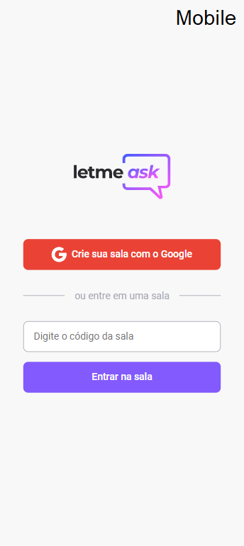

<p align="center">
  
</p>

<h1 align="center">
    
</h1>

<h1 align="center">
    
</h1>

<br>

# Next Level Week - Together

`#neverstoplearning`

## Differential

React Hot Toast, mobile version, small details with animations on the screens.

## 🧪 Technologies

This project was developed using the following technologies:

-   [React](https://reactjs.org)
-   [Firebase](https://firebase.google.com/)
-   [TypeScript](https://www.typescriptlang.org/)
-   [React Hot Toast](https://react-hot-toast.com/)

## 🚀 Getting started

Clone the project and access the folder.

```bash
$ git clone https://github.com/cogumm/NextLevelWeek.git
$ cd cd '.\#6 NLW\letmeask\'
```

Follow the steps below:

```bash
# Install the dependencies
$ yarn

# Start the project
$ yarn start

# Your Firebase account settings in the application.
## I renamed the .env.example file to just .env
$ cp .env.example .env
## Change the variables according to your Firebase settings.
```

The app will be available for access on your browser at http://localhost:3000

## 🔖 Layout

You can view the project layout through the links below:

-   [Layout Web](https://www.figma.com/file/u0BQK8rCf2KgzcukdRRCWh/Letmeask/duplicate)

Remembering that you need to have a [Figma](http://figma.com/) account to access it.

## :memo: License

Este projeto está sob licença MIT, para mais detales verifique em [LICENSE][license]

Made with ♥ by Gabriel F. Vilar :wave: [Telegram][telegram]

[telegram]: https://t.me/CoGUMm
[license]: https://cogumm.mit-license.org/
